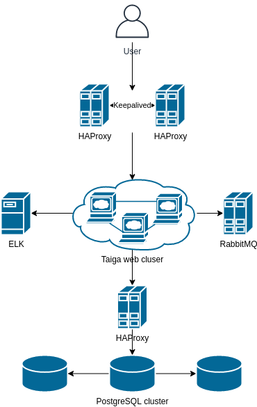

# Проектная работа курса "Linux администратор"

## Архитектура системы

Мной была выбрана [Taiga](https://taiga.io/) это бесплатная система управления проектами с открытым исходным кодом. Его интерфейс написан на AngularJS и CoffeeScript, бэкенд Django и Python. В качестве базы данных используется PostgreSQL.

Входной точкой для системы является кластер из HAProxy, на которых поднят плавающий IP keepalived. В случае падения интерфейса или ноды, IP адрес системы переплывет на другую ноду, с точки зрения пользователей ничего не изменится.

Веб приложение поднято на трех нода, запросы на которых по round-robin роутятся с HAProxy keepalived. В случае выхода из строя одной из нод, HAProxy отбрасывает ее из балансировки и запросы ходят между оставшимися нодами.

Запросы с бэкенда приложения роутятся на HAPrpoxy, который в свою очередь отправляет их на кластер Patroni на ноду, которая на текущий момент является мастер нодой.

Логи собираются в ELK.

RabbitMQ не является точкой отказой работы приложения, поэтому было принято решение не кластеризовывать его.

## Проверка

- Приложение работает по адресу <http://192.168.10.160>
- Web HAProxy stats <http://192.168.10.160/stats>
- Consul <http://192.168.10.140:8500>
- Patroni HAProxy stats <http://192.168.10.120:7000>
- RabbitMQ management <http://192.168.10.130:15672>
